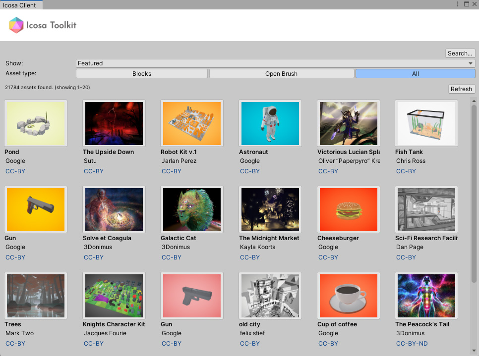

# Icosa Toolkit Unity



A Unity package for browsing, importing, and using 3D assets from [Icosa Gallery](https://icosa.gallery) at edit time and runtime.

**Based on Google Poly Toolkit for Unity**
- Original Copyright (c) 2017 Google Inc. All rights reserved.
- Additional code and modifications by Icosa Foundation 2024

## Features

- **Asset Browser**: Browse and import assets from Icosa Gallery directly in the Unity Editor
- **Runtime Import**: Fetch and instantiate 3D assets at runtime via the Icosa API
- **Edit-Time Import**: Import assets during development with full asset database integration
- **Custom OBJ Import**: Scripted importer for OBJ files with proper material and texture handling
- **Format Support**: GLTF 2.0 and OBJ formats (GLTF 1.0 and other formats are not supported)

## Requirements

- Unity 2022.3 or later (recommended)

## Installation

Install via Unity Package Manager:

1. Open Unity Package Manager (Window > Package Manager)
2. Click the **+** button and select **Add package from git URL** (ensure you've installed git system-wide))
3. Enter the following URL:

```
https://github.com/icosa-foundation/icosa-api-client-unity.git#upm
```

4. Click **Add**

## Getting Started

### Asset Browser

Access the Icosa Asset Browser from the Unity menu:

**Window > Icosa > Asset Browser**

From here you can:
- Browse featured and curated assets from Icosa Gallery
- Search for specific assets
- Preview assets with thumbnails
- Import assets directly into your project

### Runtime Import

Import assets at runtime using the Icosa API:

```csharp
using IcosaApiClient;

// Fetch and import an asset at runtime
IcosaApi.Import(assetId, importOptions, (asset, result) =>
{
    if (result.ok)
    {
        GameObject importedObject = result.Value.gameObject;
        // Use the imported object
    }
});
```

### Supported Formats

The package supports the following 3D formats:

- **GLTF 2.0** (`.gltf`) - Preferred format, imported via UnityGLTF
- **OBJ** (`.icosa-obj`) - Custom extension to override Unity's native OBJ importer

**Note**: GLTF 1.0, TILT, and other formats are not supported and will be skipped during import.

### Format Selection

When importing an asset, the package automatically selects the best available format:

1. First checks for preferred formats marked by the API
2. Priority order: GLTF 2.0 > OBJ
3. Falls back to checking all available formats if no preferred format is supported
4. Returns an error if no supported format is available

## Technical Details

### Custom OBJ Importer

The package includes a custom scripted importer for OBJ files that:
- Uses the `.icosa-obj` extension to avoid conflicts with Unity's native OBJ importer
- Properly registers meshes, materials, and textures as sub-assets
- Supports custom shaders like Poly PBR materials
- Handles texture properties beyond just `_MainTex`

### Open Brush material support

If we detect that a GLTF/GLB contains Open Brush specific materials, we automatically replace the materials with the correct ones from [Open Brush Unity Tools](https://github.com/icosa-foundation/open-brush-unity-tools)

## Development

### Project Structure

```
Packages/icosa-api-client-unity/
├── Runtime/           # Runtime scripts and shaders
├── Editor/            # Editor-only scripts (Asset Browser, Importers)
└── ThirdParty/        # Third-party libraries (OBJ loader, etc.)
```

### Building from Source

1. Clone this repository
2. Open the project in Unity
3. The package is located in `Packages/icosa-api-client-unity/`
4. Make your changes
5. Test in the Unity Editor

## Contributing

Contributions are welcome! Please feel free to submit issues and pull requests.

## License

For license information, see the `LICENSE` file.

## Links

- [Icosa Gallery](https://icosa.gallery)
- [Icosa Foundation](https://icosa.foundation)
- [Original Google Poly Toolkit](https://github.com/googlevr/poly-toolkit-unity)

---

_Unity is a trademark of Unity Technologies._
